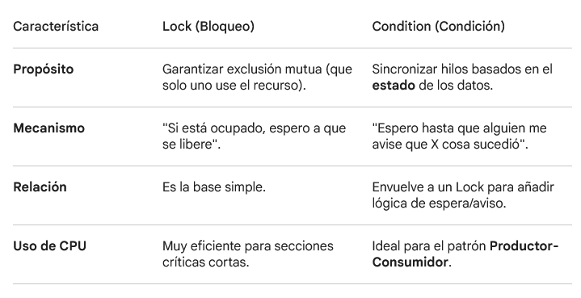

## Conditional en la bliblioteca Threading

Los Condicionales (threading.Condition) en Python son objetos de sincronización avanzados que permiten que un hilo espere hasta que se cumpla una determinada "condición" o estado, siendo notificado por otro hilo que ha provocado ese cambio.

### 1. ¿Cómo funciona un Condition?

Un objeto Condition siempre está asociado a un Lock interno (si no provees uno, Python crea un Lock o RLock por ti). Para interactuar con la condición, el hilo debe poseer el lock primero.
El flujo básico:

- **Adquisición:** El hilo adquiere el lock (with cond: o cond.acquire()).

- **Espera** ``wait()``: Si la condición lógica no se cumple, el hilo llama a wait(). Esto hace algo mágico: libera el lock automáticamente y pone al hilo a dormir. Así, otros hilos pueden entrar a modificar el estado.

- **Notificación** ``notify()``: Otro hilo cambia el estado (ej. agrega un elemento a una lista) y llama a ``notify()``.

- **Re-adquisición**: El hilo que esperaba se despierta, pero antes de seguir, vuelve a adquirir el lock automáticamente para garantizar que nadie más toque los datos mientras él verifica el estado.


### 2. Diferencia clave: Lock vs. Condition




### 3. Ejemplo Práctico: El Comensal y el Cocinero

Imagina que un cliente no puede comer si el plato está vacío. Un Lock solo evitaría que ambos toquen el plato a la vez, pero el cliente se quedaría "bloqueado" intentando comer aunque no hubiera nada. Con Condition, el cliente espera sentado (sin gastar recursos) hasta que el cocinero le avise.

````Python

import threading
import time

plato_listo = False
condicion = threading.Condition()

def consumidor():
    with condicion:
        while not plato_listo:
            print("Cliente: Esperando a que la comida esté lista...")
            condicion.wait()  # Suelta el lock y espera
        print("Cliente: ¡A comer!")

def productor():
    global plato_listo
    time.sleep(2)  # Simulando que cocina
    with condicion:
        print("Cocinero: Comida terminada.")
        plato_listo = True
        condicion.notify()  # Despierta al hilo que espera

# Iniciar hilos
threading.Thread(target=consumidor).start()
threading.Thread(target=productor).start()
````

#### ¿Por qué usamos while not plato_listo en lugar de if?

Esto es una buena práctica llamada Spurious Wakeup (despertar falso). A veces un hilo puede despertarse por error o porque otro hilo consumió el recurso justo antes. El while garantiza que, al despertar, el hilo vuelva a comprobar si la condición realmente se cumple antes de proceder.
Resumen para recordar

- Usa Lock si solo quieres que dos personas no escriban en el mismo archivo al mismo tiempo.

- Usa Condition si un hilo necesita que el trabajo de otro hilo esté "listo" antes de poder continuar.