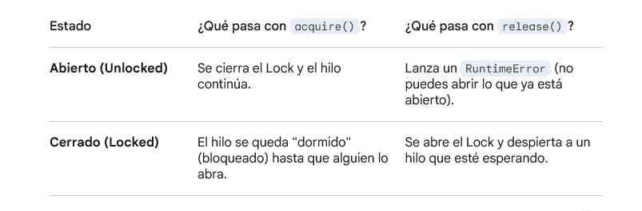
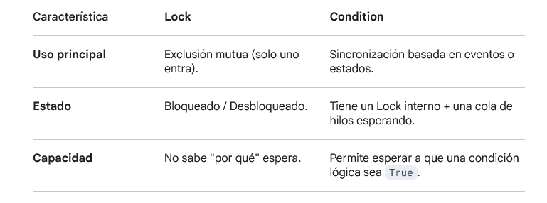

## Lock de la biblioteca Threading

### 1. El Concepto: ¿Por qué lo necesitamos?

Cuando usas hilos (threads), todos comparten la misma memoria. Si dos hilos intentan modificar la misma variable al mismo tiempo, ocurre una condición de carrera (race condition) y los datos se corrompen. El Lock asegura que solo un hilo a la vez ejecute una sección crítica de código.

### 2. Estados y Métodos Principales




### 3. Implementación en Código

#### La forma manual (No recomendada)

Es arriesgada porque si ocurre un error entre el cierre y la apertura, el Lock se queda cerrado para siempre y el programa se congela (Deadlock).

````python
import threading

lock = threading.Lock()
recurso_compartido = 0

def incrementar():
    global recurso_compartido
    lock.acquire() # Cierro la puerta
    try:
        recurso_compartido += 1
    finally:
        lock.release() # ¡Siempre abrir la puerta al terminar!
````

#### La forma elegante: Gestor de Contexto (with)

El Lock soporta el protocolo de gestión de contexto. Es la forma estándar y segura en Python:

````python
def incrementar_seguro():
    global recurso_compartido
    with lock:  # Automáticamente hace el acquire() y el release()
        recurso_compartido += 1
````

### 4. Detalles Clave

- ***Atocimidad:*** Todas las operaciones de Lock son atómicas. Esto significa que a nivel de procesador, el paso de "ver si está abierto" y "cerrarlo" ocurre en un solo paso indivisible. No hay riesgo de que dos hilos lo cierren a la vez.

- ***No tiene dueño:*** A diferencia de otros tipos de locks (como el RLock), cualquier hilo puede liberar un Lock, incluso si ese hilo no fue el que lo cerró.

- ***Bloqueo con Timeout:*** En las versiones modernas de Python (como la 3.13+ que citas), puedes intentar adquirir un lock solo por unos segundos:

````python
exito = lock.acquire(blocking=True, timeout=5)
if exito:
    # Hacer algo
    lock.release()
else:
    print("No pude entrar en 5 segundos, me rindo.")
````
### Resumen de comportamiento

- Hilo A llega y hace ``acquire()`` -> El Lock está libre, A entra y lo cierra.

- Hilo B llega y hace ``acquire()`` -> El Lock está cerrado, B se queda esperando (bloqueado).

- Hilo A termina y hace ``release()`` -> El Lock se abre y se le da paso a Hilo B.

- Hilo B despierta, cierra el Lock automáticamente y entra.

### 5. Diferencias Cruciales con Conditions



