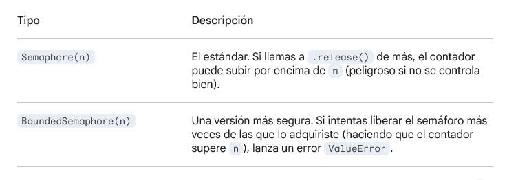

## Semáforos

En Python, un Semáforo es una primitiva de sincronización que se utiliza para limitar el acceso a un recurso compartido. A diferencia de un Lock (que es como un cerrojo único), un Semaphore permite que un número específico de hilos trabajen simultáneamente.

Piénsalo como un estacionamiento con cupos limitados: si hay 5 lugares, entran 5 autos; el sexto debe esperar a que uno salga.

### 1. El concepto del Contador

Un semáforo gestiona un contador interno que cambia según dos operaciones principales:

- ``acquire()`` (Adquirir): 

    - Si el contador es mayor a cero, lo decrementa en 1 y permite que el hilo continúe.

    - Si el contador es cero, el hilo se bloquea y espera hasta que otro hilo libere un espacio.

- ``release()`` (Liberar):

    - Incrementa el contador en 1.

    - Si hay hilos esperando, despierta a uno para que pueda entrar.

### 2. Tipos de Semáforos en threading

### 3. cómo funciona el contador del semáforo

#### 3.1. Un solo contador para gobernarlos a todos

Cuando creas ``semaforo = threading.Semaphore(3)``, ese 3 vive en un objeto central que todos los hilos pueden ver. No es que cada hilo tenga 3 vidas, es que el "estacionamiento" tiene 3 lugares en total para cualquier hilo que llegue.

#### 3.2. ¿Qué pasa cuando llega a 0?

El flujo es puramente matemático y secuencial:

- Estado Inicial: Contador = 3.

- **Hilo A** llega: Llama a ``acquire()``. El semáforo ve que 3 > 0. Resta 1. (Contador = 2). El hilo pasa.

- **Hilo B** llega: Llama a ``acquire()``. Resta 1. (Contador = 1). El hilo pasa.

- **Hilo C** llega: Llama a ``acquire()``. Resta 1. (Contador = 0). El hilo pasa.

- **Hilo D** llega: Llama a ``acquire()``. El semáforo ve que es 0.

- El bloqueo: El **Hilo D** se queda "dormido" en una cola de espera. No gasta CPU, simplemente se pausa justo en esa línea de código.

#### 3.3. ¿Cómo se "despierta" o se "reinicia"?

El contador no se reinicia automáticamente (no vuelve a 3 por arte de magia). Se incrementa solo cuando alguien termina su trabajo:

- Cuando el Hilo A termina, ejecuta ``semaforo.release()``.

- En ese instante, el contador sube de 0 a 1.

- Inmediatamente, el semáforo ve que hay hilos en la "lista de espera" (el Hilo D).

- El semáforo le entrega ese "1" al Hilo D, el contador vuelve a ser 0, y el Hilo D se despierta para trabajar    

### 4. Diferencia clave con un Lock

- ***Lock:*** Solo un hilo tiene la llave. Si el Hilo A cierra el candado, el Hilo B no puede abrirlo.

- ***Semaphore:*** Es un contador de permisos. No importa qué hilo adquirió el permiso, cualquier hilo puede liberar un espacio (aunque por buena práctica debe ser el mismo que lo usó).

**Nota de seguridad:** Se recomienda usar siempre ``BoundedSemaphore`` a menos que tengas una razón muy específica para permitir que el contador crezca indefinidamente, ya que ayuda a detectar errores de lógica donde olvidas un acquire pero ejecutas un ``release``.